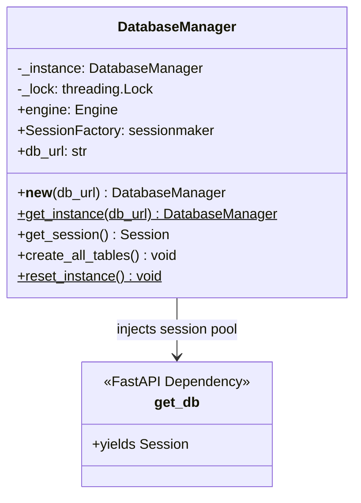
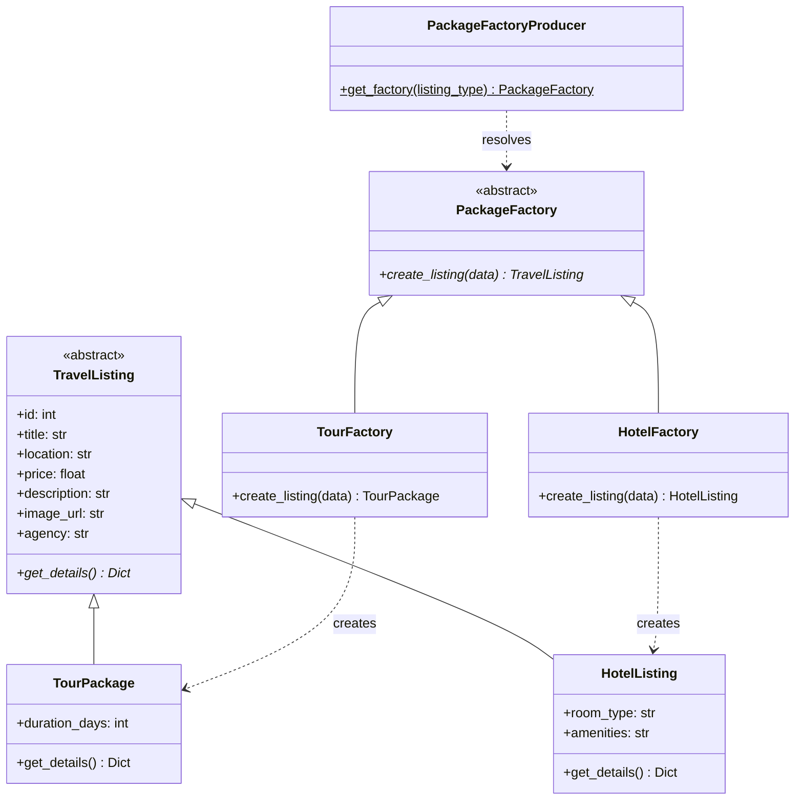
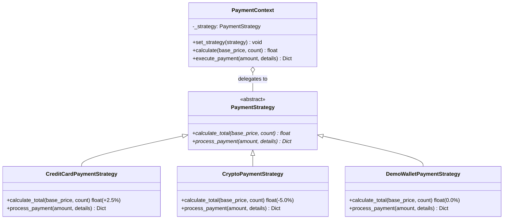
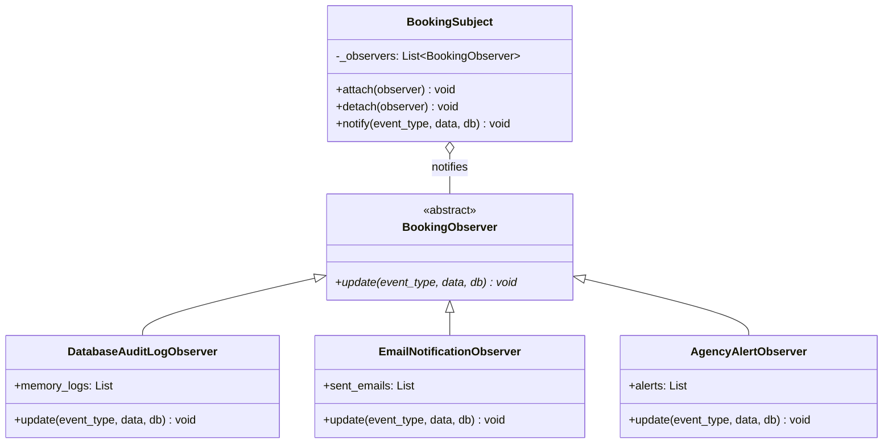
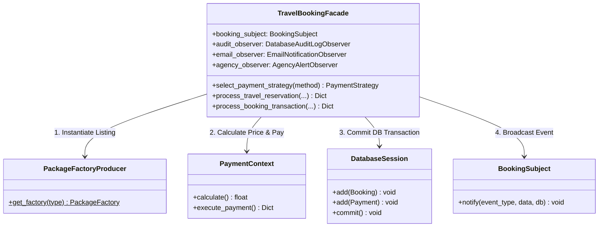

# Assignment 2: Software Design Patterns Documentation
**Project:** SAFAR — Travel & Tour Booking Platform  
**System Architecture:** React 18 + Node.js Gateway + FastAPI (Python) + PostgreSQL / SQLAlchemy

---

## Executive Summary of Implemented Design Patterns

SAFAR actively implements **5 Gang of Four (GoF) Software Design Patterns** across its core backend reservation and data management architecture:

| # | Pattern Name | Category | Primary Purpose in SAFAR | Location |
|---|---|---|---|---|
| **1** | **Singleton** | Creational | Thread-safe database engine & connection pool management | [`backend/app/db/session.py`](file:///c:/Users/user/Documents/Safar%20web%20app/Safar%20web/Safar-Web-App/backend/app/db/session.py) |
| **2** | **Factory Method** | Creational | Polymorphic instantiation of Tours vs. Luxury Hotels | [`backend/app/factories/package_factory.py`](file:///c:/Users/user/Documents/Safar%20web%20app/Safar%20web/Safar-Web-App/backend/app/factories/package_factory.py) |
| **3** | **Strategy** | Behavioral | Interchangeable payment pricing & gateway execution | [`backend/app/strategies/payment_strategy.py`](file:///c:/Users/user/Documents/Safar%20web%20app/Safar%20web/Safar-Web-App/backend/app/strategies/payment_strategy.py) |
| **4** | **Observer** | Behavioral | Event-driven audit logging, email & agency alerts | [`backend/app/observers/booking_observer.py`](file:///c:/Users/user/Documents/Safar%20web%20app/Safar%20web/Safar-Web-App/backend/app/observers/booking_observer.py) |
| **5** | **Facade** | Structural | Unified transactional booking orchestration pipeline | [`backend/app/facades/travel_booking_facade.py`](file:///c:/Users/user/Documents/Safar%20web%20app/Safar%20web/Safar-Web-App/backend/app/facades/travel_booking_facade.py) |

---

## 1. Singleton Pattern

### 1.1 Problem it Solves
In a multi-user web application, spawning a new database connection engine on every HTTP request rapidly leads to:
1. **Connection Pool Exhaustion:** Database server reaches maximum connection limits and rejects incoming user requests.
2. **Memory Leaks & Overhead:** Excessive socket allocations and garbage collection thrashing.
3. **Race Conditions:** Thread concurrency issues when initializing global state.

The **Singleton Pattern** guarantees that only **ONE** instance of `DatabaseManager` exists throughout the entire application lifecycle, maintaining a shared thread-safe connection pool.

### 1.2 Specific Files & Classes Involved
- **Implementation File:** [`backend/app/db/session.py`](file:///c:/Users/user/Documents/Safar%20web%20app/Safar%20web/Safar-Web-App/backend/app/db/session.py)
- **Primary Classes / Methods:**
  - `DatabaseManager`: Singleton manager utilizing Python's `__new__` override with `threading.Lock()` double-checked locking.
  - `DatabaseManager.get_instance(db_url)`: Static accessor method returning the singleton instance.
  - `DatabaseManager.get_session()`: Factory method returning scoped SQLAlchemy sessions bound to the single engine pool.
  - `get_db()`: FastAPI dependency generator yielding safe, autocommit-isolated sessions for HTTP controllers.
- **Unit Test File:** [`backend/tests/test_singleton.py`](file:///c:/Users/user/Documents/Safar%20web%20app/Safar%20web/Safar-Web-App/backend/tests/test_singleton.py)

### 1.3 UML Class Diagram & Structure Explanation



#### Explanation of Structure:
- `DatabaseManager` stores its single static reference in `_instance`.
- When `__new__` is called, it checks `if not cls._instance` inside a thread synchronization lock (`_lock`).
- `get_db` acts as an injection adapter for FastAPI routes, acquiring a session from the single pool and ensuring `session.close()` in its `finally` block.

---

## 2. Factory Method Pattern

### 2.1 Problem it Solves
SAFAR supports heterogeneous travel listing types: **Tour Packages** (which contain itineraries, day counts, and guided tours) and **Luxury Hotels** (which contain room types, amenities, and per-night rates). 

Directly instantiating objects with hardcoded `if/else` checks across controllers creates tight coupling and violates the **Open/Closed Principle (OCP)**. If a new listing type (e.g., *CarRental*) is added, every controller would need manual code modifications.

The **Factory Method Pattern** delegates object creation to specialized creator classes (`TourFactory` and `HotelFactory`), allowing the rest of the application to interact purely with the abstract `TravelListing` interface.

### 2.2 Specific Files & Classes Involved
- **Implementation File:** [`backend/app/factories/package_factory.py`](file:///c:/Users/user/Documents/Safar%20web%20app/Safar%20web/Safar-Web-App/backend/app/factories/package_factory.py)
- **Primary Classes / Interfaces:**
  - `TravelListing` *(Abstract Product)*: Base class with standard properties (`id`, `title`, `price`, `agency`) and abstract method `get_details()`.
  - `TourPackage` *(Concrete Product)*: Extends `TravelListing` with `duration_days` and tour metadata.
  - `HotelListing` *(Concrete Product)*: Extends `TravelListing` with `room_type` and `amenities`.
  - `PackageFactory` *(Abstract Creator)*: Declares the factory method `create_listing(data) -> TravelListing`.
  - `TourFactory` *(Concrete Creator)*: Overrides `create_listing()` to return `TourPackage`.
  - `HotelFactory` *(Concrete Creator)*: Overrides `create_listing()` to return `HotelListing`.
  - `PackageFactoryProducer` *(Producer/Resolver)*: Static helper resolving the creator based on listing type (`"tour"` vs `"hotel"`).
- **Unit Test File:** [`backend/tests/test_factory.py`](file:///c:/Users/user/Documents/Safar%20web%20app/Safar%20web/Safar-Web-App/backend/tests/test_factory.py)

### 2.3 UML Class Diagram & Structure Explanation



#### Explanation of Structure:
- `PackageFactoryProducer.get_factory("tour")` returns an instance of `TourFactory`.
- Calling `factory.create_listing(data)` instantiates the appropriate concrete product.
- Client code invokes `listing.get_details()` polymorphically without needing to inspect whether the entity is a tour or a hotel.

---

## 3. Strategy Pattern

### 3.1 Problem it Solves
Different payment methods involve distinct fee structures, authorization protocols, and validation logic:
- **Credit Card:** Adds a 2.5% merchant transaction surcharge and returns tokenized last-4 card receipts.
- **Cryptocurrency:** Applies a 5.0% instant settlement discount and generates blockchain transaction hashes.
- **SAFAR Demo Wallet:** Applies 0.0% fee with immediate local ledger balance confirmation.

Hardcoding fee arithmetic inside the checkout controller leads to brittle code and violates the **Single Responsibility Principle (SRP)**. The **Strategy Pattern** extracts each pricing and payment algorithm into interchangeable strategy classes managed by a `PaymentContext`.

### 3.2 Specific Files & Classes Involved
- **Implementation File:** [`backend/app/strategies/payment_strategy.py`](file:///c:/Users/user/Documents/Safar%20web%20app/Safar%20web/Safar-Web-App/backend/app/strategies/payment_strategy.py)
- **Primary Classes / Interfaces:**
  - `PaymentStrategy` *(Abstract Strategy)*: Defines `calculate_total(base_price, travelers_count)` and `process_payment(amount, details)`.
  - `CreditCardPaymentStrategy` *(Concrete Strategy)*: Implements 2.5% surcharge formula and card receipt generator.
  - `CryptoPaymentStrategy` *(Concrete Strategy)*: Implements 5.0% discount formula and crypto wallet transaction ID generator.
  - `DemoWalletPaymentStrategy` *(Concrete Strategy)*: Implements 0.0% fee formula and instant demo settlement.
  - `PaymentContext` *(Context)*: Holds a reference to the active `PaymentStrategy` and delegates calculation/processing requests to it at runtime.
- **Unit Test File:** [`backend/tests/test_strategy.py`](file:///c:/Users/user/Documents/Safar%20web%20app/Safar%20web/Safar-Web-App/backend/tests/test_strategy.py)

### 3.3 UML Class Diagram & Structure Explanation



#### Explanation of Structure:
- The client configures `PaymentContext` with the chosen strategy (e.g., `PaymentContext(CreditCardPaymentStrategy())`).
- When `context.calculate(price, guests)` is called, the context delegates execution to the concrete strategy's `calculate_total()` method without knowing the underlying arithmetic details.

---

## 4. Observer Pattern

### 4.1 Problem it Solves
When a traveler reserves or cancels a tour package, several downstream subsystems must react:
1. **Security Audit Log:** Must record the action and actor in the PostgreSQL `activity_logs` table.
2. **Email Service:** Must dispatch an email notification to the customer with invoice details.
3. **Agency Portal:** Must alert the travel agency partner of a new booking request.

If the booking controller directly invoked email helpers, logging helpers, and agency notifications synchronously, it would be tightly coupled, difficult to maintain, and prone to breaking if one notification channel failed.

The **Observer Pattern** creates a one-to-many relationship where the `BookingSubject` broadcasts events to all registered `BookingObserver` subscribers without knowing their concrete implementations.

### 4.2 Specific Files & Classes Involved
- **Implementation File:** [`backend/app/observers/booking_observer.py`](file:///c:/Users/user/Documents/Safar%20web%20app/Safar%20web/Safar-Web-App/backend/app/observers/booking_observer.py)
- **Primary Classes / Interfaces:**
  - `BookingObserver` *(Abstract Subscriber)*: Defines `update(event_type, data, db=None)`.
  - `DatabaseAuditLogObserver` *(Concrete Observer)*: Persists security audit records into PostgreSQL and maintains in-memory diagnostic logs.
  - `EmailNotificationObserver` *(Concrete Observer)*: Formats and dispatches simulated email receipt notices to travelers.
  - `AgencyAlertObserver` *(Concrete Observer)*: Dispatches booking alerts directly to the relevant agency provider.
  - `BookingSubject` *(Publisher / Subject)*: Maintains a registry of attached observers via `attach()`, `detach()`, and broadcasts notifications via `notify()`.
- **Unit Test File:** [`backend/tests/test_observer.py`](file:///c:/Users/user/Documents/Safar%20web%20app/Safar%20web/Safar-Web-App/backend/tests/test_observer.py)

### 4.3 UML Class Diagram & Structure Explanation



#### Explanation of Structure:
- Observers register themselves to the `BookingSubject` using `subject.attach(observer)`.
- When a booking occurs, the subject executes `subject.notify("created", payload, db)`.
- The subject iterates over its subscriber list and calls `observer.update()` on each subscriber independently.

---

## 5. Facade Pattern

### 5.1 Problem it Solves
Processing a complete travel booking requires coordinating four separate subsystems:
1. **Catalog Subsystem (Factory Method):** Fetching and polymorphic instantiation of the listing.
2. **Billing Subsystem (Strategy Pattern):** Choosing the strategy, calculating totals, and processing payment.
3. **Database Subsystem (SQLAlchemy ORM):** Creating the `Booking` and `Payment` records in a unified transaction.
4. **Event Notification Subsystem (Observer Pattern):** Broadcasting the event to audit logs, email, and agency alerts.

Exposing all these complex subsystem interactions directly in HTTP request handlers results in messy, repetitive controller code. The **Facade Pattern** wraps this multi-step workflow into a clean, unified API (`TravelBookingFacade`).

### 5.2 Specific Files & Classes Involved
- **Implementation File:** [`backend/app/facades/travel_booking_facade.py`](file:///c:/Users/user/Documents/Safar%20web%20app/Safar%20web/Safar-Web-App/backend/app/facades/travel_booking_facade.py)
- **Primary Classes / Methods:**
  - `TravelBookingFacade`: High-level facade providing:
    - `select_payment_strategy(payment_method)`: Resolves concrete strategy.
    - `process_travel_reservation(...)`: In-memory reservation pipeline for unit testing.
    - `process_booking_transaction(db, traveler, package_id, guests, payment_method, ...)`: End-to-end transactional workflow that validates database records, computes authoritative prices, writes to PostgreSQL, and notifies observers.
- **Controllers Consuming Facade:**
  - [`backend/app/routers/bookings.py`](file:///c:/Users/user/Documents/Safar%20web%20app/Safar%20web/Safar-Web-App/backend/app/routers/bookings.py) (`/api/bookings/reserve` & `/api/bookings/book-now`)
- **Unit Test File:** [`backend/tests/test_facade.py`](file:///c:/Users/user/Documents/Safar%20web%20app/Safar%20web/Safar-Web-App/backend/tests/test_facade.py)

### 5.3 UML Class Diagram & Structure Explanation



#### Explanation of Structure:
- The client (FastAPI Router) calls a single method: `facade.process_booking_transaction(...)`.
- The Facade internally orchestrates the Factory, Strategy, Database Transaction, and Observer notifications in strict sequence, returning a unified response dictionary.

---

## 🧪 Test Suite & Verification Results

All 5 design patterns are backed by dedicated test suites in `backend/tests/`:

```bash
cd backend
python -m pytest
```

### Test Suite Output:
```text
collected 73 items

tests\test_admin.py ...........                                          [ 15%]
tests\test_auth.py ...........                                           [ 30%]
tests\test_bookings.py ......                                            [ 38%]
tests\test_coverage_boost.py ....                                        [ 43%]
tests\test_facade.py .........                                           [ 56%]
tests\test_factory.py .......                                            [ 65%]
tests\test_models.py ....                                                [ 71%]
tests\test_observer.py ......                                            [ 79%]
tests\test_packages.py ....                                              [ 84%]
tests\test_singleton.py ....                                             [ 90%]
tests\test_strategy.py .......                                           [100%]

======================== 73 passed, 1 warning in 3.53s ========================
```
