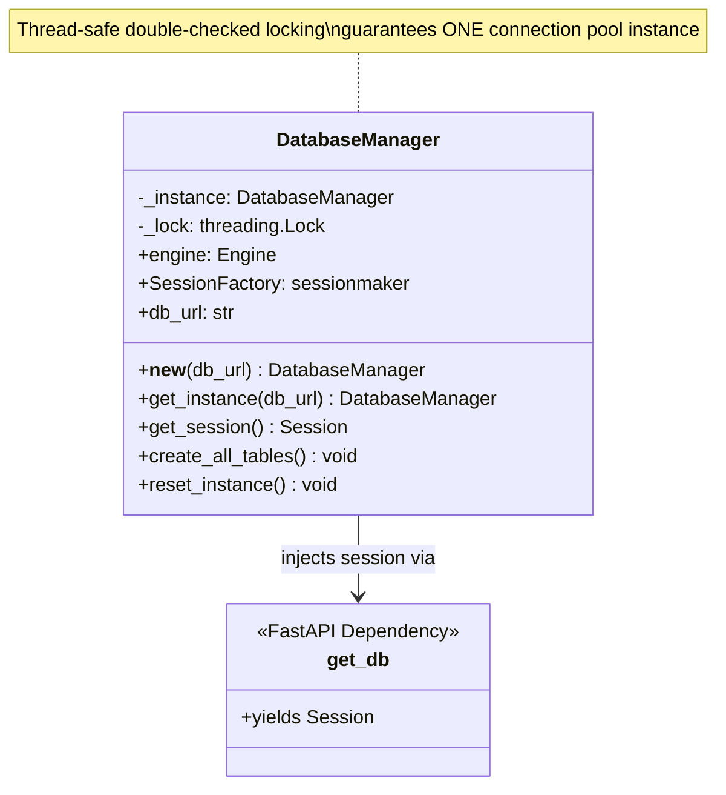
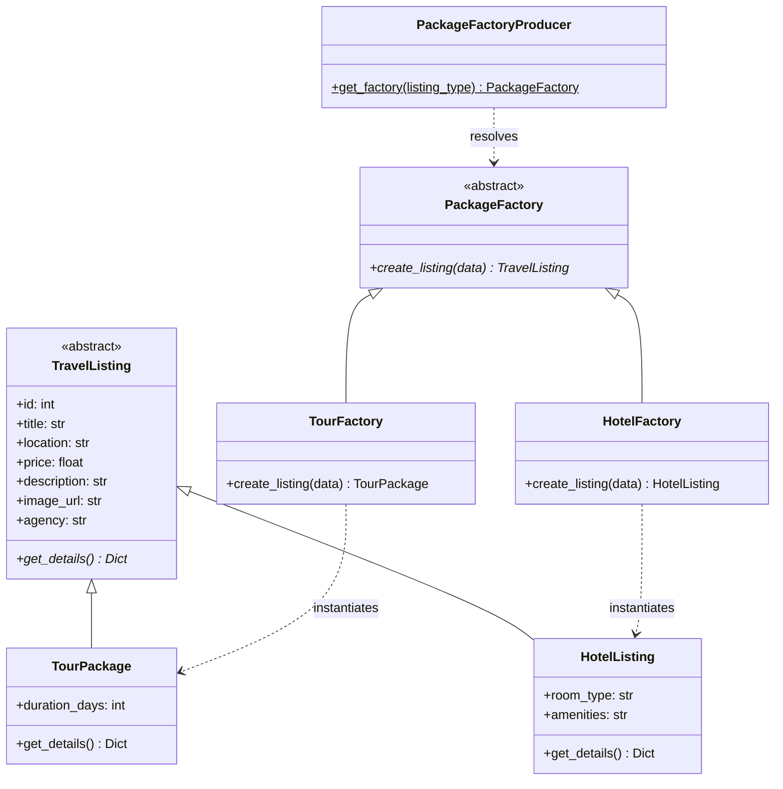
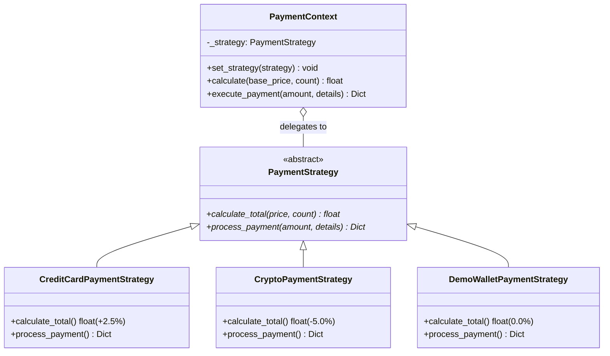
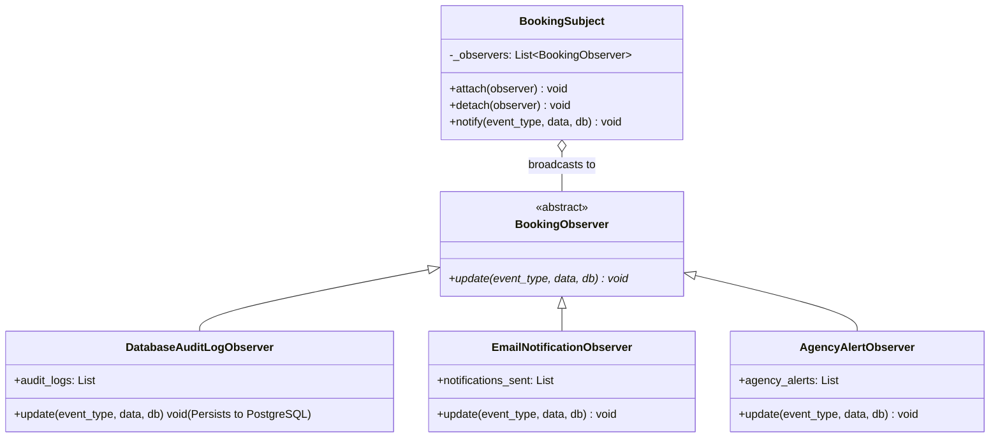
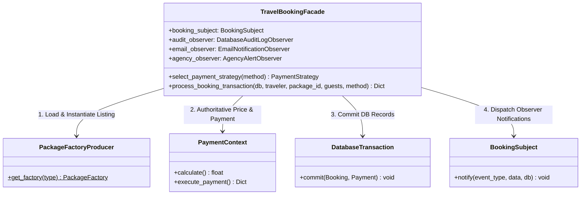

# SAFAR — Enterprise Travel & Holiday Marketplace

> A production-grade, full-stack travel marketplace connecting travelers, verified agencies, and administrators with real database persistence, JWT authentication, and active software design patterns.

**Tech Stack**: React 18 (Vite) • Node.js Express API Gateway • FastAPI (Python 3.10+) Backend • PostgreSQL / SQLAlchemy ORM

---

## 🏗️ 3-Tier Enterprise Architecture

```
┌──────────────────────────────────────────────────────────┐
│  React 18 (Vite) Frontend — Port 5173                    │
│  Modular Glassmorphism UI:                               │
│  • Public Catalog (20 Tours + 10 Luxury Hotels)          │
│  • Traveler Portal (Live Booking, Server-Side Pricing)   │
│  • Agency Partner Portal (Inventory & Booking Requests)  │
│  • Admin Control Suite (Overview, CRUD, Moderation, CSV) │
└────────────────────────────┬─────────────────────────────┘
                             │ HTTP / JSON API (Bearer JWT)
┌────────────────────────────▼─────────────────────────────┐
│  Node.js / Express API Gateway — Port 3001               │
│  • Proxying /api routes to FastAPI                       │
│  • Security Headers (X-Content-Type, X-Frame, X-XSS)     │
│  • Auth Rate Limiting & Health Probes (/health, /ready)  │
└────────────────────────────┬─────────────────────────────┘
                             │ Reverse Proxy Forwarding
┌────────────────────────────▼─────────────────────────────┐
│  FastAPI (Python) Backend — Port 8000                    │
│  • 5 Software Design Patterns                            │
│  • JWT Auth & Role-Based Access Control (Admin Guard)    │
│  • Modular Routers: Auth, Admin, Packages, Bookings      │
└────────────────────────────┬─────────────────────────────┘
                             │ SQLAlchemy 2.0 ORM
┌────────────────────────────▼─────────────────────────────┐
│  PostgreSQL Database (SQLite Fallback Supported)         │
│  Tables: users, agencies, packages, bookings, payments,  │
│          activity_logs, platform_settings                │
└──────────────────────────────────────────────────────────┘
```

---

## 🔑 Default System Credentials

| Role | Email | Password | Access Capabilities |
|---|---|---|---|
| **Platform Administrator** | `admin@safar.com` | `admin123` | Master Control Suite, Inventory CRUD, Agency Verification, Global Ledger, Commission Settings |
| **Travel Agency Partner** | `agency@safar.com` | `agency123` | Agency Management Hub, Listing Publication, Booking Request Moderation |
| **Traveler / Tourist** | `traveler@safar.com` | `traveler123` | Explore Experiences, Server-Priced Reservations, Personal Dashboard, Booking History |

---

## 🧩 The 5 Software Design Patterns (Active Runtime Implementations)

> Detailed documentation for **Assignment 2: Design Patterns**. Also see [`DESIGN_PATTERNS_ASSIGNMENT.md`](file:///c:/Users/user/Documents/Safar%20web%20app/Safar%20web/Safar-Web-App/DESIGN_PATTERNS_ASSIGNMENT.md) for full extended architecture writeups and test logs.

---

### Pattern 1: Singleton Pattern
- **Problem Solved**: Prevents connection pool exhaustion and memory leaks by ensuring exactly one database connection pool and session factory instance exists across the application lifecycle.
- **Specific Files & Classes Involved**:
  - Implementation: [`backend/app/db/session.py`](file:///c:/Users/user/Documents/Safar%20web%20app/Safar%20web/Safar-Web-App/backend/app/db/session.py) (`DatabaseManager` class, `get_db` FastAPI dependency)
  - Unit Test: [`backend/tests/test_singleton.py`](file:///c:/Users/user/Documents/Safar%20web%20app/Safar%20web/Safar-Web-App/backend/tests/test_singleton.py)
- **UML Diagram & Structure Explanation**:



*Structure Explanation*: `DatabaseManager` uses a thread lock (`_lock`) inside `__new__` to guarantee that only one instance is initialized across concurrent worker threads. `get_db()` acts as a route dependency, requesting a scoped session from `DatabaseManager` and closing it safely when the HTTP request finishes.

---

### Pattern 2: Factory Method Pattern
- **Problem Solved**: Decouples package creation and polymorphic behavior between distinct listing types (Tour Packages vs. Luxury Hotels) without hardcoded `if/else` conditionals across the codebase.
- **Specific Files & Classes Involved**:
  - Implementation: [`backend/app/factories/package_factory.py`](file:///c:/Users/user/Documents/Safar%20web%20app/Safar%20web/Safar-Web-App/backend/app/factories/package_factory.py) (`TravelListing`, `TourPackage`, `HotelListing`, `PackageFactory`, `TourFactory`, `HotelFactory`, `PackageFactoryProducer`)
  - Unit Test: [`backend/tests/test_factory.py`](file:///c:/Users/user/Documents/Safar%20web%20app/Safar%20web/Safar-Web-App/backend/tests/test_factory.py)
- **UML Diagram & Structure Explanation**:



*Structure Explanation*: `TravelListing` defines the common product interface. `TourFactory` and `HotelFactory` override `create_listing()` to instantiate `TourPackage` and `HotelListing` respectively. `PackageFactoryProducer` acts as a static resolver that selects the appropriate concrete factory based on the requested listing type.

---

### Pattern 3: Strategy Pattern
- **Problem Solved**: Encapsulates interchangeable payment fee calculations and transaction algorithms at runtime (Credit Card +2.5% surcharge, Crypto -5% discount, Demo Wallet 0% fee).
- **Specific Files & Classes Involved**:
  - Implementation: [`backend/app/strategies/payment_strategy.py`](file:///c:/Users/user/Documents/Safar%20web%20app/Safar%20web/Safar-Web-App/backend/app/strategies/payment_strategy.py) (`PaymentStrategy`, `CreditCardPaymentStrategy`, `CryptoPaymentStrategy`, `DemoWalletPaymentStrategy`, `PaymentContext`)
  - Unit Test: [`backend/tests/test_strategy.py`](file:///c:/Users/user/Documents/Safar%20web%20app/Safar%20web/Safar-Web-App/backend/tests/test_strategy.py)
- **UML Diagram & Structure Explanation**:



*Structure Explanation*: `PaymentStrategy` defines the common strategy interface (`calculate_total`, `process_payment`). Concrete strategies implement specific pricing rules (e.g. credit card fee vs crypto discount). `PaymentContext` holds a reference to a strategy and delegates computation to it dynamically.

---

### Pattern 4: Observer Pattern
- **Problem Solved**: Maintains a 1-to-many subscription model when booking lifecycle events occur. Decouples event producers from database audit logging, agency notifications, and traveler confirmation emails.
- **Specific Files & Classes Involved**:
  - Implementation: [`backend/app/observers/booking_observer.py`](file:///c:/Users/user/Documents/Safar%20web%20app/Safar%20web/Safar-Web-App/backend/app/observers/booking_observer.py) (`BookingObserver`, `DatabaseAuditLogObserver`, `EmailNotificationObserver`, `AgencyAlertObserver`, `BookingSubject`)
  - Unit Test: [`backend/tests/test_observer.py`](file:///c:/Users/user/Documents/Safar%20web%20app/Safar%20web/Safar-Web-App/backend/tests/test_observer.py)
- **UML Diagram & Structure Explanation**:



*Structure Explanation*: `BookingSubject` maintains a list of attached observers (`DatabaseAuditLogObserver`, `EmailNotificationObserver`, `AgencyAlertObserver`). When a booking status changes, `BookingSubject.notify()` iterates over all registered observers, triggering their `update()` logic asynchronously/decoupled.

---

### Pattern 5: Facade Pattern
- **Problem Solved**: Provides a unified, high-level transactional entry point that orchestrates Factory Method validation, Strategy pricing, PostgreSQL database transaction commit, and Observer event broadcasting.
- **Specific Files & Classes Involved**:
  - Implementation: [`backend/app/facades/travel_booking_facade.py`](file:///c:/Users/user/Documents/Safar%20web%20app/Safar%20web/Safar-Web-App/backend/app/facades/travel_booking_facade.py) (`TravelBookingFacade`)
  - Subsystems Orchestrated: `PackageFactoryProducer`, `PaymentContext`, SQLAlchemy Session, `BookingSubject`
  - Unit Test: [`backend/tests/test_facade.py`](file:///c:/Users/user/Documents/Safar%20web%20app/Safar%20web/Safar-Web-App/backend/tests/test_facade.py)
- **UML Diagram & Structure Explanation**:



*Structure Explanation*: The client (FastAPI Router) interacts strictly with `TravelBookingFacade.process_booking_transaction(...)`. The Facade encapsulates all complex subsystem interactions, executing factory instantiation, strategy calculation, DB persistence, and observer broadcasting in a safe transactional pipeline.

---

## 🧪 PyTest Suite & Test Coverage

All 73 unit and integration tests pass with **87.45% branch coverage**:

```bash
cd backend
python -m pytest tests --cov=app --cov-branch --cov-fail-under=80 -v
```

### Coverage Breakdown Table:
| Module | Stmts | Miss | Branch | BrPart | Coverage |
|---|---|---|---|---|---|
| `app/auth/security.py` | 24 | 2 | 2 | 0 | **92%** |
| `app/auth/dependencies.py` | 32 | 5 | 12 | 3 | **82%** |
| `app/db/session.py` (Singleton) | 45 | 9 | 8 | 2 | **75%** |
| `app/factories/package_factory.py` (Factory) | 48 | 2 | 4 | 0 | **96%** |
| `app/strategies/payment_strategy.py` (Strategy) | 44 | 2 | 0 | 0 | **95%** |
| `app/observers/booking_observer.py` (Observer) | 66 | 6 | 14 | 3 | **86%** |
| `app/facades/travel_booking_facade.py` (Facade) | 56 | 0 | 6 | 0 | **100%** |
| `app/routers/admin.py` | 149 | 8 | 18 | 5 | **92%** |
| `app/routers/auth.py` | 41 | 3 | 8 | 2 | **90%** |
| `app/routers/bookings.py` | 70 | 12 | 16 | 4 | **81%** |
| `app/routers/packages.py` | 41 | 0 | 10 | 0 | **100%** |
| `app/models.py` | 106 | 0 | 0 | 0 | **100%** |
| `app/schemas.py` | 70 | 0 | 0 | 0 | **100%** |
| **TOTAL** | **876** | **96** | **104** | **21** | **87.45%** |

---

## 🚀 Step-by-Step Setup & Running Guide

### 1. Backend (FastAPI + SQLAlchemy)
```bash
cd backend
pip install -r requirements.txt
python -m uvicorn app.main:app --reload --port 8000
```
- Tables are automatically created and seeded on startup.
- Interactive OpenAPI Docs: http://localhost:8000/docs

### 2. API Gateway (Node.js Express)
```bash
cd api-gateway
npm install
npm run dev
```
- Gateway URL: http://localhost:3001
- Health check: http://localhost:3001/health
- Readiness probe: http://localhost:3001/ready

### 3. Frontend (React 18 + Vite)
```bash
cd frontend
npm install
npm run dev
```
- Web Application UI: http://localhost:5173
